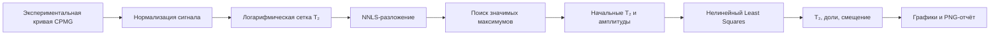

# NMR T₂ Relaxation Analyzer

[](https://www.python.org/)
[](https://scipy.org/)
[](https://www.riverbankcomputing.com/software/pyqt/)
[](LICENSE)

Desktop application for multi-exponential analysis of NMR transverse relaxation curves.

Приложение для мультиэкспоненциального анализа кривых поперечной релаксации ЯМР.

[Русская версия](#русский) · [English version](#english)

---

## Русский

### О проекте

**NMR T₂ Relaxation Analyzer** — настольное приложение для количественного анализа данных ядерно-магнитного резонанса.

Программа разлагает экспериментальную кривую затухания поперечной намагниченности, полученную методом CPMG, на сумму экспоненциальных компонент и определяет:

- времена релаксации T₂;
- относительную долю каждой компоненты;
- постоянное смещение сигнала;
- суммарную амплитуду модели;
- остатки аппроксимации.

Приложение объединяет автоматическую аппроксимацию, ручную корректировку параметров и экспорт готового графического отчёта.

### Математическая модель

Экспериментальный сигнал описывается моделью:

$$
S(t) = A \sum_{i=1}^{N} p_i e^{-t/T_{2,i}} + B,
$$

где:

- $T_{2,i}$ — время поперечной релаксации компоненты;
- $p_i$ — относительная доля компоненты;
- $A$ — суммарная амплитуда;
- $B$ — постоянное смещение;
- $N$ — количество экспоненциальных компонент.

Для относительных долей выполняется:

$$
p_i \geq 0, \qquad \sum_{i=1}^{N} p_i = 1.
$$

### Алгоритм

Расчёт выполняется в два этапа.



#### 1. Автоматический поиск компонент

На логарифмической сетке из 150 значений T₂ строится система экспоненциальных базисных функций.

Метод неотрицательных наименьших квадратов — **Non-Negative Least Squares, NNLS** — оценивает начальный спектр амплитуд. После этого выбираются наиболее значимые локальные максимумы.

#### 2. Уточнение параметров

Найденные параметры используются как начальное приближение для нелинейной оптимизации `scipy.optimize.least_squares`.

Оптимизация уточняет:

- времена релаксации;
- амплитуды компонент;
- постоянное смещение.

### Возможности

- загрузка файлов `.txt` и `.nmr`;
- автоматическое определение значимых компонент;
- выбор максимального количества компонент от 1 до 6;
- нелинейное уточнение параметров;
- таблица времён T₂ и относительных долей;
- ручное добавление и удаление компонент;
- перенос результатов автоматического расчёта в ручной режим;
- редактирование T₂, долей, амплитуды и смещения;
- линейное представление сигнала;
- логарифмическое представление;
- график остатков;
- настройка границ осей и размера маркеров;
- экспорт графического отчёта в PNG с разрешением 300 DPI.

### Формат входных данных

Входной файл должен содержать минимум два числовых столбца без заголовка:

```text
0.001  1.0000
0.002  0.9431
0.003  0.8914
0.004  0.8447
0.005  0.8021
```

Первый столбец — время, второй — амплитуда сигнала.

Разделителем может быть пробел или символ табуляции.

Рекомендуется передавать время в секундах. Текущая реализация считает значения времени микросекундами и делит их на `1 000 000`, если первое значение времени больше 10.

### Готовая сборка для Windows

Скомпилированную версию приложения можно скачать с [Google Drive](https://drive.google.com/drive/folders/18Y2yvi7775m9-ZTp07OsHrJVgGfg6kIe?usp=drive_link).

После скачивания:

1. распакуйте архив;
2. откройте папку `dist`;
3. запускайте приложение, не перемещая исполняемый файл отдельно от остальных файлов сборки;
4. при необходимости создайте ярлык приложения на рабочем столе.

### Использование

1. Нажмите **«Загрузить файл»** и выберите файл `.txt` или `.nmr`.
2. Укажите максимальное количество экспоненциальных компонент.
3. Нажмите **«Расчёт»**.
4. Проверьте полученные T₂, доли и график остатков.
5. При необходимости скопируйте результат во вкладку ручного подбора.
6. Скорректируйте параметры.
7. Сохраните итоговый отчёт в PNG.

### Запуск кода

#### 1. Клонирование репозитория

```bash
git clone https://github.com/Ralifgrannik/Approximation-of-NMR-data.git
cd Approximation-of-NMR-data
```

#### 2. Создание виртуального окружения

```bash
python -m venv .venv
```

Windows:

```powershell
.venv\Scripts\activate
```

Linux/macOS:

```bash
source .venv/bin/activate
```

#### 3. Установка зависимостей

```bash
pip install numpy scipy matplotlib PyQt6
```

#### 4. Запуск приложения

```bash
python main.py
```


### Структура репозитория

```text
.
├── main.py       # Вычислительное ядро и графический интерфейс
├── README.md     # Документация
└── LICENSE       # Лицензия MIT
```

### Ограничения

- Метод предполагает дискретное количество экспоненциальных компонент.
- Близко расположенные времена T₂ могут быть плохо различимы.
- Результат зависит от уровня шума и длительности экспериментальной кривой.
- Максимумы со слишком малой амплитудой могут быть отброшены как шум.
- Перед физической интерпретацией результаты следует проверять по остаткам и экспериментальным условиям.
- Программа является исследовательским инструментом и не предназначена для медицинской диагностики.

### План развития

- добавить демонстрационные наборы данных;
- реализовать автоматические тесты вычислительного ядра;
- добавить пакетную обработку файлов;
- экспортировать результаты в CSV;
- рассчитывать RMSE и дополнительные показатели качества;
- оценивать неопределённость найденных параметров;
- публиковать Windows-сборки через GitHub Releases.

---

## English

### About

**NMR T₂ Relaxation Analyzer** is a desktop application for quantitative analysis of Nuclear Magnetic Resonance data.

It decomposes transverse magnetization decay curves acquired using the CPMG method into a sum of exponential components and estimates:

- T₂ relaxation times;
- relative component fractions;
- constant signal offset;
- total model amplitude;
- fitting residuals.

The application combines automatic fitting, manual parameter refinement and high-resolution report generation.

### Mathematical Model

The measured signal is represented as:

$$
S(t) = A \sum_{i=1}^{N} p_i e^{-t/T_{2,i}} + B,
$$

where:

- $T_{2,i}$ is the transverse relaxation time;
- $p_i$ is the relative fraction of the component;
- $A$ is the total amplitude;
- $B$ is the constant offset;
- $N$ is the number of exponential components.

The component fractions satisfy:

$$
p_i \geq 0, \qquad \sum_{i=1}^{N} p_i = 1.
$$

### Method

The fitting procedure consists of two stages.

#### 1. Automatic component search

A system of exponential basis functions is constructed using a logarithmic grid of 150 candidate T₂ values.

**Non-Negative Least Squares — NNLS** estimates the initial amplitude spectrum. Significant local maxima are then selected as candidate components.

#### 2. Nonlinear refinement

The initial parameters are refined using `scipy.optimize.least_squares`.

The optimization estimates:

- relaxation times;
- component amplitudes;
- constant offset.

### Features

- `.txt` and `.nmr` file import;
- automatic component detection;
- configurable maximum of 1–6 components;
- nonlinear parameter refinement;
- T₂ and component-fraction table;
- manual component editing;
- transfer of automatic results into manual mode;
- editable T₂ values, fractions, amplitude and offset;
- linear-scale visualization;
- logarithmic-scale visualization;
- residual plot;
- configurable axes and marker size;
- 300 DPI PNG report generation.

### Input Format

The input file must contain at least two numeric columns without a header:

```text
0.001  1.0000
0.002  0.9431
0.003  0.8914
0.004  0.8447
0.005  0.8021
```

The first column contains time values and the second contains signal amplitudes.

Values may be separated by spaces or tabs.

Time values in seconds are recommended. The current implementation interprets time as microseconds and divides it by `1,000,000` when the first time value is greater than 10.

### Installation

```bash
git clone https://github.com/Ralifgrannik/Approximation-of-NMR-data.git
cd Approximation-of-NMR-data

python -m venv .venv
```

Activate the environment on Windows:

```powershell
.venv\Scripts\activate
```

On Linux or macOS:

```bash
source .venv/bin/activate
```

Install the dependencies:

```bash
pip install numpy scipy matplotlib PyQt6
```

Run the application:

```bash
python main.py
```

### Windows Build

A compiled Windows version is available on [Google Drive](https://drive.google.com/drive/folders/18Y2yvi7775m9-ZTp07OsHrJVgGfg6kIe?usp=drive_link).

Keep the executable inside the extracted `dist` directory because the application may depend on adjacent files included in the build.

### Usage

1. Click **Load File** and select a `.txt` or `.nmr` file.
2. Choose the maximum number of exponential components.
3. Run the automatic calculation.
4. Inspect the estimated T₂ values, fractions and residuals.
5. Copy the result into manual mode if refinement is required.
6. Adjust the parameters.
7. Export the final report as a PNG image.

### Repository Structure

```text
.
├── main.py       # Computational core and PyQt6 interface
├── README.md     # Project documentation
└── LICENSE       # MIT License
```

### Limitations

- The method assumes a discrete number of exponential components.
- Components with similar T₂ values may be difficult to distinguish.
- Results depend on the noise level and acquisition window.
- Low-amplitude peaks may be rejected as noise.
- Results should be reviewed together with residuals and experimental conditions.
- This is a research tool and is not intended for medical diagnosis.

### Roadmap

- add example datasets;
- add automated tests for the fitting core;
- support batch processing;
- export numerical results to CSV;
- calculate RMSE and additional quality metrics;
- estimate parameter uncertainty;
- publish packaged applications through GitHub Releases.

## License

Distributed under the [MIT License](LICENSE).

## Author

Developed by [Ralifgrannik](https://github.com/Ralifgrannik).
